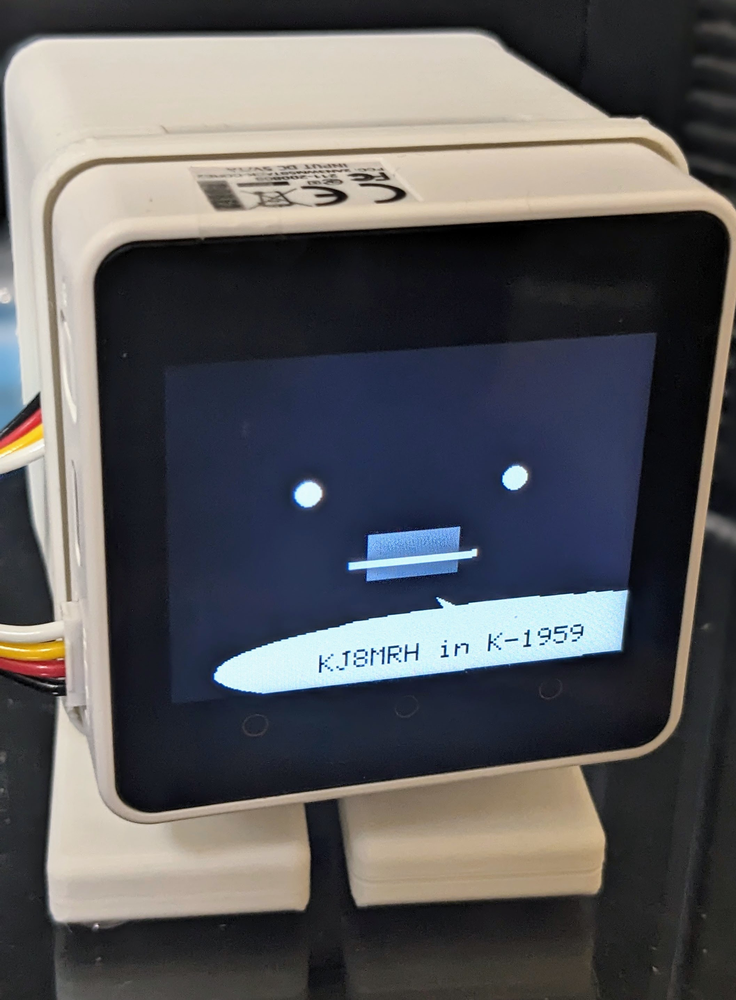
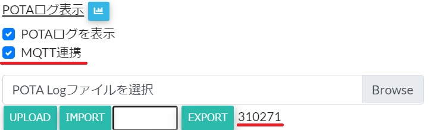

# M5SpotChan
「ｽﾎﾟｯﾄﾁｬﾝ」はSOTA/POTAのスポットを読み上げてくれる、コミュニケーションロボット[ｽﾀｯｸﾁｬﾝ](https://github.com/robo8080/M5Unified_StackChan_ChatGPT_Google)の親戚です。指定した地域のスポットを日本語又は英語で読み上げてくれます。

※ｽﾎﾟｯﾄﾁｬﾝの開発にあたっては[M5Unified_StackChan_ChatGPT_Google](https://github.com/robo8080/M5Unified_StackChan_ChatGPT_Google)を参考に一部コードを利用させていただいています。

***
### ロボット本体の作り方
こちらのキットを使うと簡単に製作できます。
* [ｽﾀｯｸﾁｬﾝ M5GoBottom版組み立てキット](https://raspberrypi.mongonta.com/about-products-stackchan-m5gobottom-version/ "Title") 

### M5Stackへのインストール
[M5Stack Core2](https://m5stack.com/)又は[M5Stack Core](https://m5stack.com/)に対応しています。PlatformIOでビルド後インストールしてください。また[M5Burner](https://docs.m5stack.com/en/download)にM5Stack Core2用のファームウェアがアップロードされています。

### 設定ファイルのインストール
`config`フォルダにある`spotchan.json`に以下の情報を記載し、FATでフォーマットしたマイクロSDカードのルートディレクトリにおいてください。

|項目|値|
|:----------|:----------|
|wifi_ssid|WiFi SSID|
|wifi_passwd|WiFi パスワード|
| volume|音量(0-255)|
|subscription|MQTTサブスクリプション|
| importkey| myACTのIMPORTキー|

MQTTサブスクリプションには配信を受けるスポット情報を記載します。
* 日本国内のSOTA/POTAをスポットを受ける場合 
  `"subscription" : ["js/spot/pota/ja", "js/spot/sota/ja"],`
* 全てのSOTA/POTAのスポットを受ける場合 
  `"subscription" : ["js/spot/pota/#", "js/spot/sota/ww"],`

POTAのハンターログを[myACT](https://myact.sotalive.net)にアップロードしている場合は、設定ダイアログで「MQTT連携」にチェックを入れ、EXPORTボタンを押して下さい。 

次にEXPORTボタンの横に表示される6桁の番号を以下のように設定ファイルに記載してください。 
  `"importkey": "310271",` 

myACTとハンターログを共有し、未ハントの公園のスポットは「未ハントの新しいPOTAスポットです」と教えてくれます。

### 使い方
最初にM5Stackを起動するとマイクロSDカードから設定ファイルを読み込みます。一度設定ファイルを詠み込むと内部の不揮発メモリに書き込むのでSDカードは外して構いません。以降、起動時は不揮発メモリの設定情報を読み込みます。設定を変更したい場合はボタンBを押しながら起動するとSDカードから再度設定ファイルを読み込みます。

ボタンAを押すとスポットの開始・停止を切り替えます。ボタンBは最後に通知したスポットを再度繰り返し読み上げます。ボタンCはご挨拶です。

